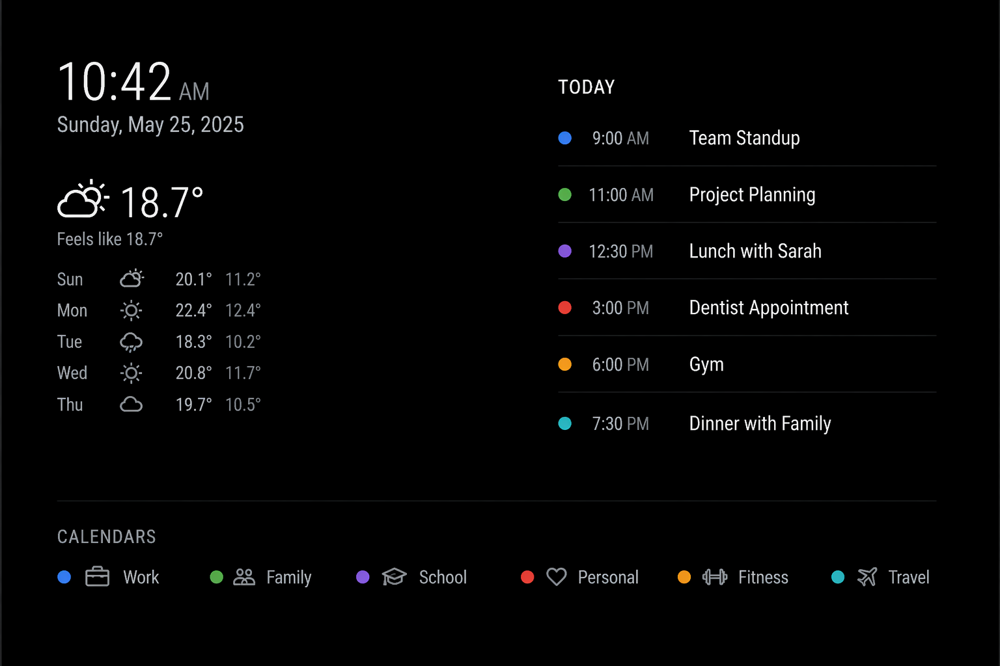

# MMM-TodayBlock

A MagicMirror² module that displays **today's calendar events** in a clean, minimal block.

---

## ✨ Features

- Shows only today's events with optional location
- Combines all configured calendars automatically
- Color-coded events (matches calendar colors)
- Clean, minimal layout
- Lightweight (no external dependencies)
- Easy to customize

---

## 📸 Screenshot



---

## 📦 Installation

Clone this module into your MagicMirror `modules` directory:

`cd ~/MagicMirror/modules`  
`git clone https://github.com/ex247/MMM-TodayBlock.git`

---

## ⚙️ Configuration

Add the following to your `config.js`:

``` 
{
  module: "calendar",
  config: {
    broadcastEvents: true
  }
},
{
  module: "MMM-TodayBlock",
  position: "top_right",
  config: {
    maxEvents: 8,
    timeFormat: "h:mm A",
    showAllDay: true,
    showHeader: true,
    headerText: "Today",
    showLocation: true,
  }
}
```

---

## 🔧 Configuration Options

| Option       | Default   | Description |
|--------------|----------|-------------|
| maxEvents    | 10       | Maximum number of events to display |
| timeFormat   | h:mm A   | Time format for events |
| showAllDay   | true     | Show "All Day" label for full-day events |
| showHeader   | true     | Show header text |
| headerText   | Today    | Header label text |
| showLocation | false    | Show event location in block |

---

## 🧠 Requirements

This module depends on the built-in MagicMirror calendar module with event broadcasting enabled:

```
{
  module: "calendar",
  config: {
    broadcastEvents: true
  }
}
```

---

## Update

Navigate into the `MMM-TodayBLock` folder with cd ~/MagicMirror/modules/MMM-TodayBlock and get the latest code from Github with `git pull`.

If you haven't changed the modules, this should work without any problems. Type `git status` to see your changes, if there are any, you can reset them with `git reset --hard`. After that, `git pull` should be possible.

---

## 🎨 Styling

Customize appearance in:

MMM-TodayBlock.css

Key CSS classes:

- today-block
- today-header
- event-row
- event-dot
- event-time
- event-title
- event-location

---

## 🚀 Example Layout

TODAY  
● 9:00 AM   Team Standup  📍 Teams Meeting
● 12:00 PM  Lunch  📍 Palace Place, Anaheim, CA
● 3:00 PM   Dentist  📍 Dr. Doe Dental, San Jose, CA

---

## 🧩 Future Ideas

- Horizontal pill layout mode
- Group by calendar
- Icons per calendar source
- Highlight current event
- Animations for upcoming events

---

## 📄 License

MIT License

---

## 🙌 Contributing

Pull requests welcome!

---

## ⭐ Credits

Built for the MagicMirror² community
